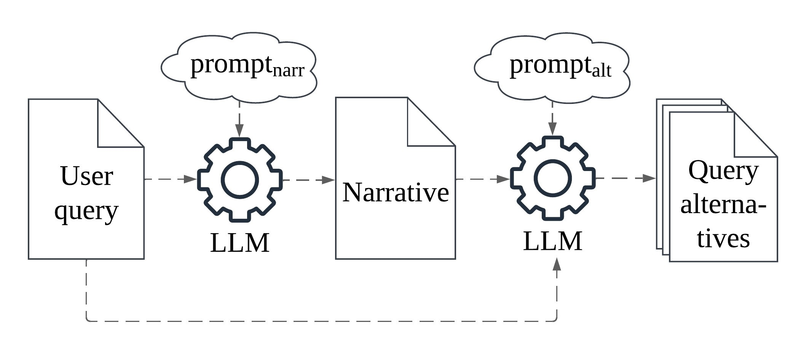

# Generating Effective Health Queries

This is the public code release for the **ACM SIGIR 2025** short paper **"Generating Effective Health-Related Queries for Promoting Reliable Search Results"**, by **Xiana Carrera, Marcos Fernández-Pichel and David E. Losada**.

Our project introduces a novel method that leverages Large Language Models (LLMs) to generate alternative formulations of health-related search queries, with the aim of reducing the prevalence of misinformation in search results. Specifically, we generate synthetic narratives that guide the creation of these alternative queries, which are designed to retrieve more helpful and fewer hamrful documents compared to the original user queries.



## Installation

First, clone this repository:

```bash
git clone https://github.com/xianacarrera/Generating-Effective-Health-Queries
```

Create a new environment from the `environment.yml` file. By default, its name will be `healquery`:

```bash
conda env create -f environment.yml
# To change the environment name:
# conda env create -f environment.yml -n new-env-name
```

Activate the environment:
```bash
conda activate healquery
# Alternatively:
# conda activate new-env-name
```


This project runs on a modified version of the [BEIR](https://github.com/beir-cellar/beir/) library, in order to be able to evaluate different models on custom datasets without the need of explicitely providing a corpus file. This both streamlines the evaluation process and allows to test models on corpus of big size such as the ones used in this project.

## Generation resources

With the non-deterministic nature of LLMs in mind, for transparency and reproducibility we include all key resources used to produce the results presented in the paper:

* **Prompts**. The file `prompts.txt` contains the exact prompts used to generate the narratives and alternative queries with both GPT-4 and LLaMA3, along with a description of the different variations explored during experimentation. The prompts have already been programmatically integrated into the `llm_connector.py` module, which contains the code relevant to those steps of our pipeline where an LLM is used.

* **Generated narratives**. Narrative outputs generated by the LLMs are included in the `generated_narratives` directory. They are organized by dataset and LLM model (gpt-4 or LLaMA3). These narratives serve as contextual expansions of the user queries with the goal of influencing the generation of alternative queries to reduce misinformation with query-dependent context.

* **Search rankings**. We also provide the ranked lists of search results obtained using BM25 or MiniLM-L-12-v2. Compatibility scores are then computed from these rankings by using the `compatibility.py` program, which is a slightly modified version of the original implementation from [https://github.com/claclark/compatibility](https://github.com/claclark/compatibility). Our modifications retain the scoring algorithm and only adapt the script to handle non-sequential query IDs in our datasets and to manage cases where queries lack positive/negative relevance judgments (qrels).


## Contact
For any questions or issues, feel free to reach out at [xiana.carrera@rai.usc.es](mailto:xiana.carrera@rai.usc.es).

