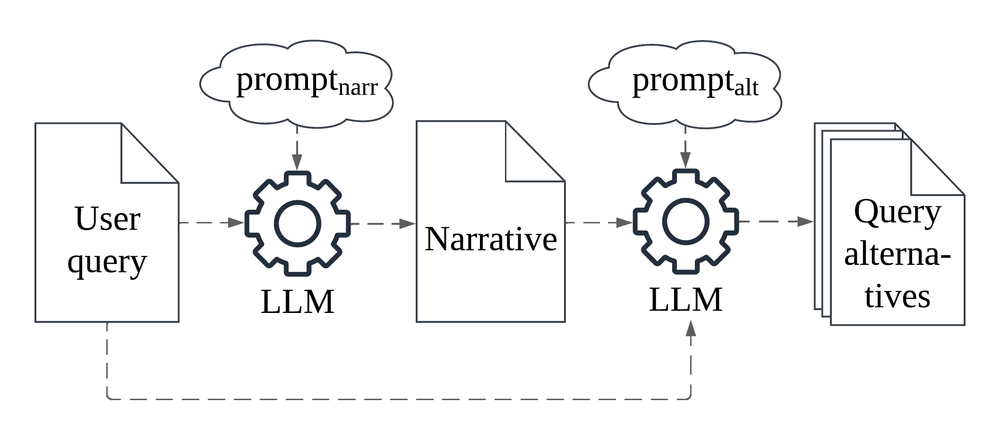

# Generating Effective Health Queries

This is the public code release for the **ACM SIGIR 2025** short paper **"Generating Effective Health-Related Queries for Promoting Reliable Search Results"**, by **Xiana Carrera, Marcos Fernández-Pichel and David E. Losada**.

Our project introduces a novel method that leverages Large Language Models (LLMs) to generate alternative formulations of health-related search queries, with the aim of reducing the prevalence of misinformation in search results. Specifically, we generate synthetic narratives that guide the creation of these alternative queries, which are designed to retrieve more helpful and fewer hamrful documents compared to the original user queries.



## Installation

First, clone this repository:

```bash
git clone https://github.com/xianacarrera/Generating-Effective-Health-Queries
```

Create a new environment from the `environment.yml` file. By default, its name will be `healquery`:

```bash
conda env create -f environment.yml
# To change the environment name:
# conda env create -f environment.yml -n new-env-name
```

Activate the environment:
```bash
conda activate healquery
# Alternatively:
# conda activate new-env-name
```


This project runs on a modified version of the [BEIR](https://github.com/beir-cellar/beir/) library, in order to be able to evaluate different models on custom datasets without the need of explicitely providing a corpus file. This both streamlines the evaluation process and allows to test models on corpus of big size such as the ones used in this project: TODO.


## Issues
For any questions or issues, feel free to reach out at [xiana.carrera.alonso@usc.es](mailto:xiana.carrera.alonso@usc.es).

## Licensing
